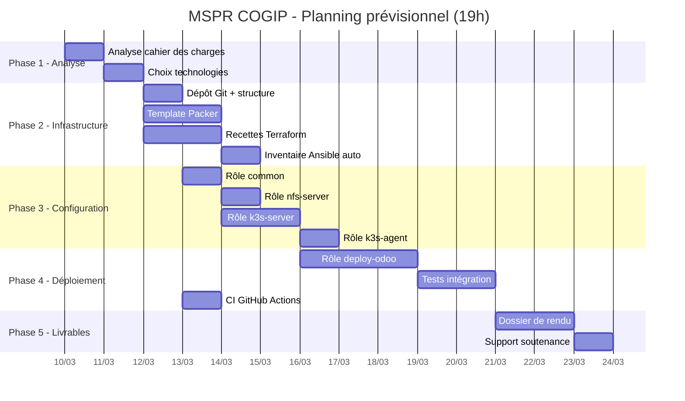

# Mission 2 : Diagramme de Gantt — Planning prévisionnel

## Estimation des tâches (19h de préparation)

| # | Tâche | Responsable | Durée estimée | Dépendances |
|---|-------|-------------|---------------|-------------|
| T1 | Analyse du cahier des charges COGIP | Équipe | 1h | - |
| T2 | Choix des technologies et justification | Équipe | 1h | T1 |
| T3 | Mise en place du dépôt Git et structure projet | Dev 1 | 0.5h | T2 |
| T4 | Rédaction du template Packer (image Ubuntu) | Dev 1 | 1.5h | T2 |
| T5 | Rédaction des recettes Terraform (4 VMs) | Dev 2 | 2h | T2 |
| T6 | Rédaction de l'inventaire Ansible auto-généré | Dev 2 | 0.5h | T5 |
| T7 | Rôle Ansible `common` (config de base VMs) | Dev 3 | 1h | T2 |
| T8 | Rôle Ansible `nfs-server` | Dev 3 | 1h | T7 |
| T9 | Rôle Ansible `k3s-server` (control-plane) | Dev 1 | 2h | T7 |
| T10 | Rôle Ansible `k3s-agent` (workers) | Dev 1 | 1h | T9 |
| T11 | Rôle Ansible `deploy-odoo` (NFS prov, cert-manager, Helm) | Dev 2 | 2.5h | T9, T8 |
| T12 | Tests d'intégration et débogage | Équipe | 2h | T10, T11 |
| T13 | CI GitHub Actions (validation IaC) | Dev 4 | 1h | T3 |
| T14 | Rédaction du dossier de rendu | Équipe | 2h | T12 |
| T15 | Préparation support de soutenance | Équipe | 1h | T14 |

**Total : ~19h** (conforme au sujet)

## Diagramme de Gantt (format Mermaid)

## Répartition par membre de l'équipe

| Membre | Tâches principales | Charge estimée |
|--------|-------------------|----------------|
| **Dev 1** | Packer (T4), K3s server/agent (T9, T10), Git (T3) | ~5h |
| **Dev 2** | Terraform (T5, T6), Deploy Odoo Helm (T11) | ~5h |
| **Dev 3** | Ansible common (T7), NFS server (T8) | ~2h + support |
| **Dev 4** | CI/CD (T13), documentation, revue technique | ~2h + support |
| **Équipe** | Analyse (T1, T2), Tests (T12), Livrables (T14, T15) | ~7h |
